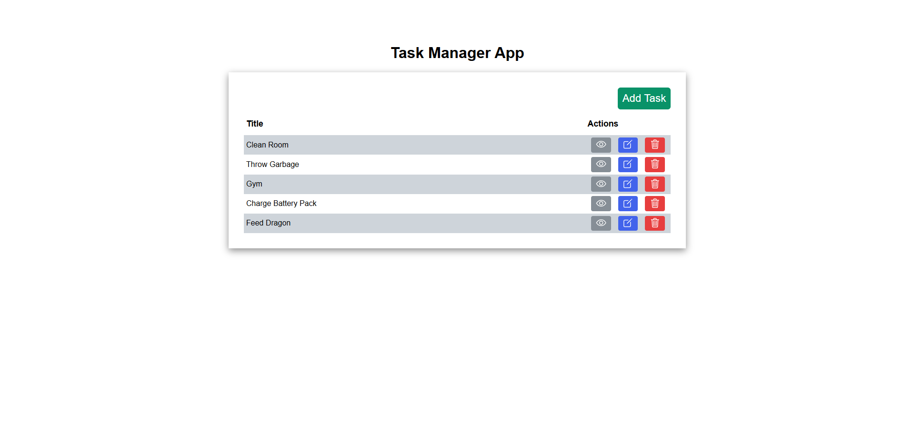

# Task Manager App

Welcome to the Task Manager App! This is a simple web application for managing tasks, built using **Node.js**, **Express**, and **MongoDB**. It allows you to create, view, edit, and delete tasks, providing a clean and straightforward interface for handling your to-dos.

;

## Features

- **Add Task**: Create new tasks with a title and description.
- **View Task**: View details of a task.
- **Edit Task**: Modify the title or description of an existing task.
- **Delete Task**: Remove tasks from the task list.
- **Task List**: Displays all tasks in a table format.

## Tech Stack

- **Backend**: Node.js with Express
- **Database**: MongoDB (via Mongoose)
- **Frontend**: HTML, CSS, and EJS templates for rendering dynamic content
- **Icons**: Ionicons for interactive icons

## Prerequisites

- Node.js (version 14 or higher)
- MongoDB running locally or hosted on a server

## Setup

### 1. Clone the repository

```bash
git clone https://github.com/tkyDevs/Task_Manager_App.git
cd Task_Manager_App
```

### 2. Install Dependencies

 - Make sure you have Node.js installed, then run:
```bash
npm install
```

### 3. Set up MongoDB

Ensure that MongoDB is running locally on the default port (27017). If you don't have MongoDB installed, you can follow the official MongoDB installation guide.

### 4. Start the server

Run the following command to start the app:
```bash
npm start
```
The app will be running on http://localhost:3000.

## Routes

GET /: Home page displaying a list of tasks.
GET /addTask: Displays a form to add a new task.
POST /addTask: Adds a new task to the task list.
GET /viewTask/:taskId: View details of a specific task.
GET /editTask/:taskId: Edit a specific task.
POST /editTask/:taskId: Updates the task details.
POST /deleteTask/:taskId: Deletes a specific task.

## Usage

 - Open the app in your browser at http://localhost:3000.
 - Use the Add Task button to add a new task.
 - Tasks are displayed in a table format, and each task has options to View, Edit, or Delete.
 - Clicking View will show detailed information about a task.
 - Clicking Edit will let you modify the title and description of the task.
 - Clicking Delete will remove the task from the list.

## Contributing

1. Fork the repository.
2. Create a new branch (git checkout -b feature-name).
3. Commit your changes (git commit -am 'Add feature').
4. Push to the branch (git push origin feature-name).
5. Create a new Pull Request.

## Technologies Used

- **Node.js** and **Express** for the server-side logic.
- **MongoDB** and **Mongoose** for the database.
- **EJS** for rendering dynamic HTML pages.
- **Ionicons** for interactive icons.
